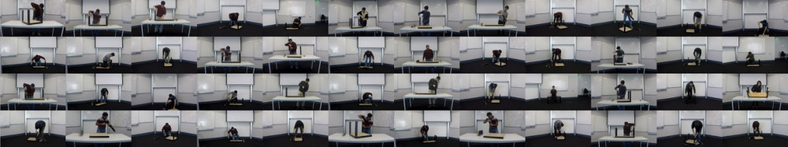

# Pose prediction code

<p align="center">
  <a href="http://users.cecs.anu.edu.au/~u5568237/ikea/" target="_blank">
    
  </a>
</p>

This repository contains the code for "[Human Pose Prediction via Deep Markov
Models](https://arxiv.org/pdf/1707.09240.pdf)" (Toyer et al., DICTA'17). The
instructions below explain how to preprocess our [Ikea Furniture
Assembly](http://users.cecs.anu.edu.au/~u5568237/ikea/) dataset and train both
an LSTM baseline and a deep Markov model to predict poses on that dataset.

## Installing dependencies

This repository has several dependencies on [PyPI](https://pypi.org/), as listed
in `requirements.txt`. If you have [the `virtualenv` and `virtualenvwrapper`
package management tools
installed](http://exponential.io/blog/2015/02/10/install-virtualenv-and-virtualenvwrapper-on-ubuntu/),
then you can install the following dependencies in an isolated development
environment using the following commands in a shell:

    mkvirtualenv -p "$(which python2)" pose-prediction-env
    pip install -r requirements.txt
    
(unless stated otherwise, it's assumed that all commands, including the ones
above, are run from the root of this repository)

The installed dependencies will only be usable from within the virtual
environment. Whenever you open a new shell & want to use this code, you'll need
to remember to execute `workon pose-prediction-env` to re-renter the
environment. That will prepend the name of the environment to your shell prompt,
like this:

    $ workon pose-prediction-env
    (pose-prediction-env)$ python -c 'print("now we can run Python, etc., with correct deps")'

As a final setup step, we'll make a directory to place all of our results in:

    mkdir ikea-fa-results 

## Obtaining the data

These instructions assume that you want to train a model to predict poses on
Ikea Furniture Assembly dataset. If you don't have the dataset already, then you
can download it using the following commands:

    wget 'http://users.cecs.anu.edu.au/~u5568237/ikea/ikea-fa-release-data.zip'
    unzip -j ikea-fa-release-data.zip ikea-fa-release-data/processed-python-data/ikea_action_data.h5 -d .
    
This will create a file named `ikea_action_data.h5` in the current directory
(`md5sum` is 92b334d368b798d5456401014aaf21c6). Note that most of the data in
`ikea-fa-release-data.zip` is _videos_, which you will probably want later, but
which you don't actually _need_ just to train some prediction models. If you
just want the `.h5` file for the purpose of following these instructions, then
you can get it from [this
link](https://mega.nz/#!ULwV1KYK!E2IxcLk3QaX3wMeMmSO5xHOMfcXZ2guYUU1Ni6KB77I).

### Datasets other than Ikea FA

Most other datasets supported by this code---including Human3.6M (H3.6M), the
NTU RGBD dataset, the Penn Action dataset, and so on---require an additional
conversion step before you can use them. Specifically, you need to use one of
the `convert_<dataset>.py` scripts to convert from the original dataset format
to a uniform HDF5-based format that makes it easy for other tools in this
repository to get at pose data. Refer to the inbuilt help for each script to see
how to do this (e.g. `python convert_ntu.py --help`).

## Training & evaluating an LSTM baseline

In our paper, we compared against several sequence regression baselines. You can
train and test one such baseline as follows:

```bash
# choose lstm, lstm3lr, or erd
BASELINE=lstm
# this will train the model; once it has trained for a while (probably a few
# hours, or until the displayed loss stops going down), you can interrupt it
# with Ctrl+C to stop (there's no early-stopping IIRC)
python basic_lstm_baselines.py "$BASELINE" ikea_action_data.h5 ikea-fa-results/baselines/
# re-running the script will produce results
python basic_lstm_baselines.py "$BASELINE" ikea_action_data.h5 ikea-fa-results/baselines/
```

`results_${BASELINE}.h5` contains both ground truth and predicted poses for the
Ikea FA test set. You can calculate statistics for such a file using
`stats_calculator.py`, e.g.

```bash
python stats_calculator.py --output_dir ./ikea-fa-results/csv/ \
  "./ikea-fa-results/baselines/results_${BASELINE}.h5"
```

This will write some PCK statistics to CSV files in `ikea-fa-results/csv`.

## Training & evaluating a deep Markov model

Code for the deep Markov models is in the `structuredinference` directory. A DMM
can be trained using the following commands:

```
# if using another dataset, replace "ikeadb" with the dataset name (e.g.
# ntu-2d, h36m-2d, etc.)
cd structuredinference/expt-ikeadb
cp ../../ikea_action_data.h5 ./
bash runme-no-actions.sh
```


# Broken instructions that I need to tidy up and merge (copied from wiki)

To get results, use `common/make_eval_results.py`:

```bash
cd ~/repos/structuredinference/expt-ikeadb
source /usr/local/anaconda/bin/activate dkf
python ../common_pp/make_eval_results.py ./runme-no-actions.sh chkpt-ikeadb/MODEL-config.pkl chkpt-ikeadb/MODEL-EPNNN-params.npz results_dkf.h5
```

MODEL will be something really long like
`DKF_lr-8_0000e-04-vm-LR-inf-structured-dh-50-ds-50-nl-relu-bs-20-ep-2000-rs-600-ttype-simple_gated-etype-mlp-previnp-False-ar-1_0000e+03-rv-5_0000e-02-nade-False-nt-5000-cond-False-ikeadb-no-acts`;
look in the checkpoints dir to figure out what the full thing is.

How to make videos from DKF predictions: at the moment, my code for making
videos from DKF predictions is in the DKF directory (!!). You can run it with
the following sequence of commands:

```bash
cd ~/repos/structuredinference/expt-ikeadb
source activate pose-prediction  # python 3 env is fine
./make_eval_videos.py results_dkf.h5 --vid-dir some-dest-dir
```

It will select a random sequence each time, so re-run a few times to plot a good range.

Making statistics and plotting PCK: it works something like this:

```bash
cd /path/to/pose-prediction/

# repeat this call as necessary for all your baselines
# you may need --max-thresh to pick a threshold for (normalised) comparisons
# e.g. ikea works well with --max-thresh 0.1, NTU works well with --max-thresh 1
./stats_calculator.py --output_dir ikea_baselines/ ikea_baselines/_zero_velocity.h5

# the next two make actual plots of various sorts (sorry, forgot what they actually are)
./plot_pck.py --stats-dir ~/etc/pp-baselines/2017-05-02/stats/ --methods dkf srnn erd lstm lstm3lr zero_velocity --method-names DKF SRNN ERD LSTM LSTM3LR "Zero-velocity" --parts elbows shoulders wrists --save plot.pdf --fps 16 --times 1 10 25 50 --no-thresh-px --dims 6 8 && mv plot.pdf plot-xtype-thresh.pdf
# maybe this one has time on the x-axis, and the above has a threshold?
./plot_pck.py --stats-dir ~/etc/pp-baselines/2017-05-02/stats/ --methods dkf srnn erd lstm lstm3lr zero_velocity --method-names DKF SRNN ERD LSTM LSTM3LR "Zero-velocity" --parts elbows shoulders wrists --save plot.pdf --legend-below --xtype time --fps 16 && mv plot.pdf plot-xtype-time.pdf
```
